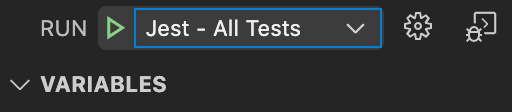

# create-react-app config

This is the `launch.json` file you should use in vscode when developing inside a `create-react-app` project. This will point to the necessary react-scripts to kick off Jest inside the IDE.

This `launch.json` currently supports four different test suites:

1. Test All
2. Test All and Show Code Coverage
3. Watch Mode (interactive with menu, will watch for updates to test files)
4. Open Files Only (only test the jest files currently open in the project)

All of these suites can be found by clicking on the `Run` button on your side menu  

Select the test suite and press the green triangle to run the tests  

